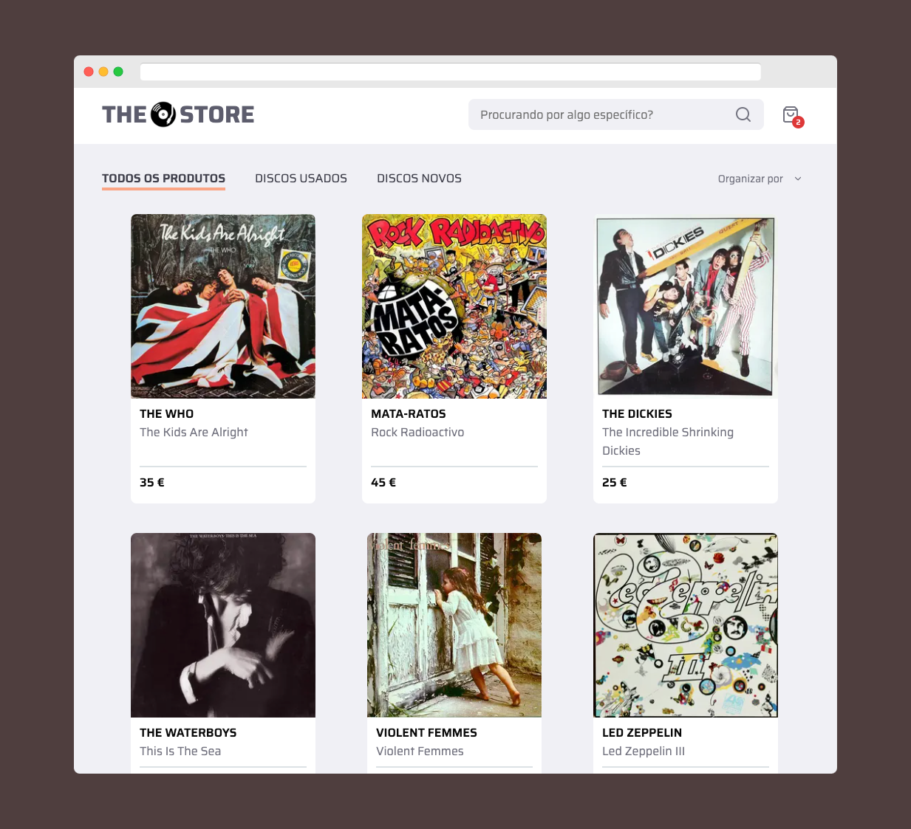

# The Record Store

Full featured web application for demonstration purposes

## Features

A Record Store web application built using:

- NextJS
- Typescript
- CSS modules
- Prisma

Connected to a mongodb database

## Clone repository

Create a new folder named for example "therecordstore" and clone the repository into it

run `mkdir therecordstore && cd therecordstore`

run `git clone https://github.com/NunoCPNP/therecordstore.git .`

run `npm install`

## Available Scripts

`npm start` Start application in development mode

`npm test` Run application unit tests

## Folder Structure

## Environment Variables

## Notes

Code styling is ensured by ESLint and Prettier and applied on save if you use VSCode editor or on push via precommit hook

Commit messages follow [conventional commit](https://www.conventionalcommits.org/en/) guidelines and are mandatory
